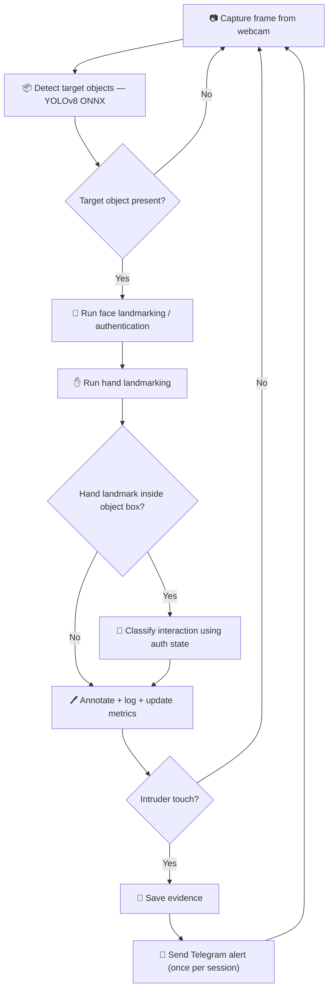
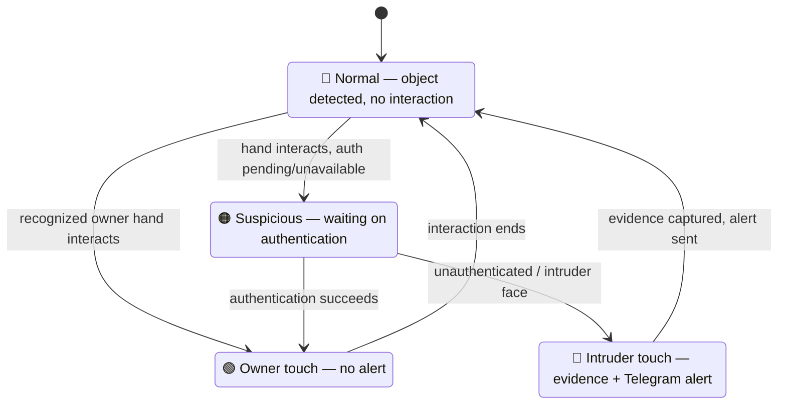

<div align="center">


# Owner-Aware Temporal Monitoring of Personal Food and Drink Containers Using Edge AI for Unauthorized Interaction Detection


<br/>


</div>

> [!IMPORTANT]
> This system is built for **thesis research and controlled demonstrations**. It is **not** a production security system and should not be relied on as the sole means of protecting people or property.

---

## 📖 Table of Contents

- [Overview](#-overview)
- [Features](#-features)
- [Pipeline Overview](#-pipeline-overview)
- [Requirements](#-requirements)
- [Installation](#-installation)
- [Configuration](#-configuration)
- [Running the Application](#-running-the-application)
- [Threat States](#-threat-states)
- [Testing and Evaluation](#-testing-and-evaluation)
- [Training and Model Export](#-training-and-model-export)
- [Repository Layout](#-repository-layout)
- [Privacy and Security](#-privacy-and-security)
- [Known Limitations](#-known-limitations)
- [License](#-license)

---

## 🧠 Overview

This project is a **real-time, edge-oriented computer-vision pipeline** for detecting possible unauthorized interactions with personal food and drink containers — bottles, cups, and bowls.

It combines:

`Object Detection` · `Face Authentication` · `Hand Landmark Tracking` · `ROI Analysis` · `Event Logging` · `Evidence Capture` · `Telegram Alerts`

---

## ✨ Features

| | Feature | Description |
|---|---|---|
| 🎥 | **Real-time monitoring** | Webcam-based detection loop using OpenCV. |
| 📦 | **YOLOv8 ONNX detection** | Detects bottles, cups, and bowls. |
| 🙂 | **Face landmarks + auth** | MediaPipe face landmarks with InsightFace embedding comparison against a local owner image. |
| ✋ | **Hand landmark tracking** | MediaPipe hand landmarks for interaction detection. |
| ⚡ | **Object-detection gating** | Face/hand processing is skipped when no target object is visible, saving compute. |
| 🟩 | **ROI-based interaction checks** | Determines whether a hand enters an object's bounding box. |
| 🚦 | **Threat-state classification** | Normal, owner touch, suspicious, and intruder touch states. |
| 📲 | **Telegram alerts** | Optional snapshot + buffered video clip, sent once per session. |
| 🗂️ | **CSV logging** | Event and performance logs, including CPU/RAM/GPU stats when available. |
| 📊 | **Benchmark utilities** | Dataset benchmarking and IoU-based evaluation. |

---

## 🔄 Pipeline Overview



---

## 🧰 Requirements

| Requirement | Details |
|---|---|
| Python | 3.8 or newer |
| Webcam | Required for real-time monitoring |
| OS | Windows, macOS, or Linux — default camera backend is `cv2.CAP_DSHOW` (Windows); change in `main.py` for other platforms |
| Disk space | Several GB free for Python packages and model assets |
| Compute | CPU capable of running ONNX Runtime and InsightFace. A GPU may help with training; runtime pipeline uses CPU providers by default |

---

## ⚙️ Installation

Create and activate a virtual environment, then install the runtime dependencies:

```powershell
python -m venv .venv
.\.venv\Scripts\Activate.ps1
python -m pip install --upgrade pip
python -m pip install -r requirements.txt
```

On macOS/Linux, activate the environment with:

```bash
source .venv/bin/activate
```

The repository contains some model binaries, but `utils_download.py` can download the MediaPipe assets that are missing:

```bash
python -c "from utils_download import download_models; download_models()"
```

`main.py` expects these files in the project root:

- `hand_landmarker.task`
- `face_landmarker.task`
- `yolov8s.onnx`
- `user.jpg`

> [!NOTE]
> The owner image is intentionally ignored by Git. Add your own private `user.jpg` — **do not commit it.**

---

## 🔐 Configuration

Copy the example configuration file and set values only in your local environment:

```powershell
Copy-Item .env.example .env
$env:TELEGRAM_TOKEN = "your-bot-token"
$env:TELEGRAM_CHAT_ID = "your-chat-id"
```

The application reads `TELEGRAM_TOKEN` and `TELEGRAM_CHAT_ID` when sending alerts. If they are absent, the pipeline logs that Telegram is not configured and continues without sending an alert.

`ROBOFLOW_API_KEY` is needed only by `data_build.py` to download the training dataset.

> [!WARNING]
> Never put API keys in source files or notebooks.

---

## ▶️ Running the Application

Start the real-time monitoring pipeline:

```bash
python main.py
```

Press **`q`** in the OpenCV window to stop.

The pipeline creates runtime outputs in `evidence/` and `data-logs/`; these directories are ignored because their contents are machine- and session-specific.

---

## 🚦 Threat States



| State | Meaning | Expected action |
|---|---|---|
| 🔵 **Normal** | A target object is detected without a hand interaction. | Blue/orange object annotation; no alert. |
| 🟢 **Owner touch** | A recognized owner hand interacts with an object. | Green annotation; no alert. |
| 🟠 **Suspicious** | A hand interacts while face authentication is pending or unavailable. | Orange annotation; wait for authentication. |
| 🔴 **Intruder touch** | An unauthenticated or intruder face interacts with an object. | Red annotation, evidence capture, optional Telegram alert. |

---

## 🧪 Testing and Evaluation

Run the lightweight sequence-logic test:

```bash
python test_sequence_logic.py
```

Run the image benchmark after creating `test_dataset/images` and adding matching images:

```bash
python test_pipeline.py
```

The benchmark writes annotated images to `test_dataset/results` and metrics to `dataset-test-logs/`.

For ground-truth evaluation, provide YOLO label files in `test_dataset/labels` and run:

```bash
python evaluate_metrics.py
```

The evaluator reports per-class and overall **precision, recall, F1**, and detection-rate-style accuracy at an **IoU threshold of 0.50**. It can also generate a confusion matrix.

<details>
<summary>📓 <strong>Notebooks with extended notes, experiments, and demos</strong></summary>
<br/>

- `Complete.ipynb`
- `Complete_Project.ipynb`
- `Project_Report_and_Implementation.ipynb`

> [!NOTE]
> Notebook cells may assume local model files, a webcam, or a dataset that is not included in this repository.

</details>

---

## 🏋️ Training and Model Export

`data_build.py` downloads a Roboflow dataset, trains a YOLO model, and exports it to ONNX.

Configure the API key first:

```powershell
$env:ROBOFLOW_API_KEY = "your-roboflow-key"
python data_build.py
```

Training requires the additional `roboflow` and `ultralytics` packages and is generally best run on a machine with a supported GPU. Training outputs are written under `runs/` and are ignored by Git.

---

## 📁 Repository Layout

```text
ezyZip/
├── main.py                         # Real-time orchestration and alert flow
├── module_objects.py                # YOLOv8 ONNX object detector
├── module_faces.py                  # MediaPipe landmarks and InsightFace auth
├── module_hands.py                  # MediaPipe hand landmark tracker
├── module_roi_segmentation.py       # ROI extraction and interaction geometry
├── module_metrics.py                # Performance and tamper CSV logging
├── utils_download.py                # MediaPipe model download helper
├── data_build.py                    # Roboflow download and YOLO training
├── test_pipeline.py                 # Dataset inference benchmark
├── test_sequence_logic.py           # Object-gating behavior test
├── evaluate_metrics.py              # IoU and detection metric evaluation
├── requirements.txt                 # Python dependencies
├── .env.example                     # Local configuration template
├── LICENSE                          # MIT license
└── *.ipynb                          # Reports, experiments, and implementation notes
```

> [!NOTE]
> Model binaries may be distributed separately from the source because of their size and upstream terms. Review the license and usage terms for YOLO, MediaPipe, InsightFace, ONNX Runtime, and any downloaded dataset before redistribution or commercial use.

---

## 🔒 Privacy and Security

The face-authentication workflow processes a reference face image and camera frames.

> [!WARNING]
> Keep `user.jpg`, captured evidence, logs, API keys, and Telegram credentials **private**. The default `.gitignore` excludes these local artifacts, but always inspect `git status` before publishing.
>
> Previously exposed credentials should be revoked and replaced at their providers. Environment variables prevent new accidental exposure but do **not** invalidate credentials that were already shared.

---

## ⚠️ Known Limitations

<details>
<summary>Click to expand</summary>
<br/>

- Authentication depends on lighting, camera quality, face pose, and the quality of `user.jpg`.
- The interaction rule is based on hand landmarks entering an object bounding box; this can produce false positives or false negatives.
- The runtime detector uses a fixed 640×640 input and CPU ONNX inference.
- The default camera backend and some diagnostic commands are platform-specific.
- Telegram delivery requires network access and correctly configured credentials.
- The included tests do not exercise the full webcam, model, Telegram, or hardware path.
- Reported FPS, memory, and accuracy values depend on the device, model, dataset, and configuration; benchmark them on your own environment.

</details>

---

## 📄 License

This project is licensed under the **MIT License**. See [LICENSE](LICENSE).

<div align="center">


</div>
